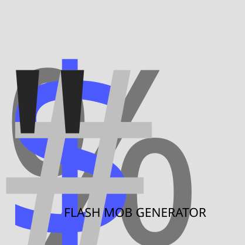

<p align="center">
  
</p>

# Unicode Flash Mob

Unicode Flash Mob 是一个以 Rust、Tauri 和 React 构建的 Unicode 字形视频生成器。它可以从一个或多个字体中提取字符，使用 JSON 配置控制排版、颜色、事件和编码参数，并将 RGBA 帧直接传输给 FFmpeg。

## 主要能力

- 从 TTF、OTF 等字体中提取 Unicode 映射并生成配置。
- 使用 `U+XXXX`、`/glyphName` 和 `#glyphIndex` 选择字形。
- Unicode 选择器通过 Parley/HarfRust 应用 OpenType shaping、feature、可变字体轴与 optical sizing；`{fontIndex}` 只固定该 Unicode run 使用的字体，连续且 fontIndex 相同的码点仍一起 shaping。只有显式 `/glyphName` 与 `#glyphIndex` 保持 exact-glyph 语义并绕过 GSUB/GPOS substitution。
- 支持有序场景组件、每组件字体回退、彩色字体、组合字符和事件动画。
- 支持单进程编码与分段多进程编码，并限制在途 RGBA 帧以控制内存占用。
- 提供桌面 GUI 与独立 CLI。

## 环境要求

- Node.js 22 或 24。CI 使用 Node.js 22；pnpm 11 不支持 Node.js 20 及更早版本。
- pnpm 11.18.0。版本已由根目录 `package.json` 的 `packageManager` 字段固定。
- Rust stable，以及 `rustfmt` 和 `clippy` 组件。
- Tauri CLI 2.x。本文与 CI 使用 `^2.9.0`，以确保支持 `tauri build --no-sign`。
- FFmpeg，可位于配置指定路径、应用资源目录或进程 `PATH` 中。
- [Tauri 对应平台的系统依赖](https://v2.tauri.app/start/prerequisites/)。

Linux 发布包建议在 Ubuntu 22.04 或同等基线上构建，以避免生成依赖过新 glibc 的二进制文件。

## 开发

以下命令均从仓库根目录执行。根目录没有 `Cargo.toml`；Rust manifest 位于 `src-tauri/Cargo.toml`。

首次配置 pnpm 时，建议先更新并启用 Corepack：

```bash
npm install --global corepack@latest
corepack enable pnpm
```

项目的 `packageManager` 字段会让 Corepack 使用固定的 pnpm 版本。随后安装依赖与 Tauri CLI：

```bash
git clone https://github.com/Losketch/Unicode-Flash-Mob.git
cd Unicode-Flash-Mob
pnpm install --frozen-lockfile
rustup component add rustfmt clippy
cargo install tauri-cli --version "^2.9.0" --locked
cargo tauri dev
```

仅启动前端浏览器预览：

```bash
pnpm dev
```

浏览器预览不能调用 Tauri 文件对话框、任务事件或 Rust 渲染命令。

## 构建桌面应用

从仓库根目录执行：

```bash
pnpm install --frozen-lockfile
cargo tauri build --ci --no-sign -- --locked
```

`cargo tauri build` 会根据 `src-tauri/tauri.conf.json` 自动执行 `beforeBuildCommand`，因此会再次运行 `pnpm build`，然后构建 release 二进制和当前平台的 bundle／安装包。产物位于：

```text
src-tauri/target/release/bundle/
```

`--no-sign` 只适合本地验证和普通 CI。正式签名发布时应配置平台签名凭据，并移除该参数：

```bash
cargo tauri build --ci -- --locked
```

## CI

GitHub Actions 分为两个阶段：

1. Ubuntu 22.04 上执行前端构建、Rust 格式检查、CLI-only 检查、全部测试和 Clippy。
2. 质量检查通过后，在 Windows、macOS 和 Ubuntu 22.04 上分别执行真正的 `cargo tauri build`，并上传 `src-tauri/target/release/bundle/**`。

## CLI

CLI 可以不编译 Tauri GUI 依赖。所有命令均从仓库根目录执行，并显式指定 Rust manifest：

```bash
cargo run --manifest-path src-tauri/Cargo.toml --no-default-features --features cli --locked -- --help
```

常用命令：

```bash
# 从字体生成配置
cargo run --manifest-path src-tauri/Cargo.toml --no-default-features --features cli --locked -- \
  extract ./example.ttf --output unicode_config.json

# 根据配置渲染视频
cargo run --manifest-path src-tauri/Cargo.toml --no-default-features --features cli --locked -- \
  render --config unicode_config.json

# 渲染单帧预览
cargo run --manifest-path src-tauri/Cargo.toml --no-default-features --features cli --locked -- \
  frame --config unicode_config.json --entry-index 0 --output frame-preview.png

# 生成默认配置
cargo run --manifest-path src-tauri/Cargo.toml --no-default-features --features cli --locked -- \
  config unicode_config.json

# 下载 UnicodeData.txt 与 Blocks.txt；后者在本项目中保存为 UnicodeBlocks.txt
cargo run --manifest-path src-tauri/Cargo.toml --no-default-features --features cli --locked -- \
  download --output src-tauri/assets/data

# 直接验证字体的 OpenType feature 与可变轴
cargo run --manifest-path src-tauri/Cargo.toml --no-default-features --features cli --locked -- \
  font-preview --font ./example.ttf --text "ffi" --feature liga=1 --variation wght=650
```

## 场景组件与配置版本

配置 schema 当前为 `4`。画面不再固定为一个 `main_text` 和一个 `bottom_text`，而是由有序的 `components` 数组组成；数组顺序就是绘制顺序，后面的组件覆盖前面的组件。

目前实现两种基础组件：

- `glyph`：用于 Unicode 码点、glyph name、glyph index 等字形选择器。Unicode 内容会作为完整 text run shaping；Unicode 后的 `{fontIndex}` 用于固定该 run 的字体而不关闭 shaping，`/glyphName` 与 `#glyphIndex` 才保留 exact-glyph 语义。
- `text`：用于说明文字、Unicode 元数据和自定义文本。由 Parley/HarfRust 完成 text-run shaping、Bidi、cluster、GSUB/GPOS、换行和字体 fallback，最终字形交给 Swash / usvg-resvg paint backend。
- Phase 2 的 paint backend 使用局部 4× supersampling：普通 outline、COLR v0、彩色 bitmap 由 Swash 4× raster，COLR v1 / SVG-in-OpenType 由 resvg 4× raster，再以 alpha-aware box downsample 合成到目标帧。连接脚本的单色 glyph coverage 会先在高分辨率网格做 union，再降采样，避免目标分辨率 AA 边缘重复叠加。
- SVG-in-OpenType 按 OpenType 的 em-square 初始 viewport、y-down/baseline-y=0 语义解析；resvg 负责 selected-node bbox 本地化，caller 只保留目标像素的 subpixel offset，避免对 SVG ink bbox 重复平移和裁切。

每个文字相关组件独立持有 `fonts` 与 `font`，因此可以分别设置字号、fallback、OpenType feature、variation axis 与 optical sizing。例如：

```json
{
  "schema_version": 4,
  "components": [
    {
      "type": "glyph",
      "id": "main",
      "enabled": true,
      "content": "{glyph}",
      "position": { "x": 0.5, "y": 0.5 },
      "color": { "r": 0, "g": 0, "b": 0, "a": 128 },
      "fonts": ["assets/fonts/Example.ttf"],
      "font": {
        "size": 512,
        "font_feature_settings": { "liga": 1 },
        "font_variation_settings": { "wght": 650 },
        "font_optical_sizing": true
      },
      "overlay_combining_mark": true
    },
    {
      "type": "text",
      "id": "caption",
      "enabled": true,
      "content": "{code}\n{description}",
      "position": { "x": 0.05, "y": 0.95 },
      "color": { "r": 0, "g": 0, "b": 0, "a": 192 },
      "fonts": ["assets/fonts/Caption.ttf"],
      "font": {
        "size": 42,
        "font_feature_settings": {},
        "font_variation_settings": {},
        "font_optical_sizing": true
      },
      "align": "left",
      "wrap": true,
      "max_width": 0.9
    }
  ]
}
```

v3 的 `main_font`、`bottom_font`、`main_text`、`bottom_text` 仍可读取。加载后后端会将它们迁移为默认 `glyph`/`text` 组件；再次保存时写出 v4 结构。高于当前版本的 schema 会被拒绝加载或保存，避免旧版程序把未来组件/字段静默降级并造成数据丢失。

## 内容模板项

所有 `glyph` / `text` 组件的 `content` 都先经过统一的模板解析器。内建占位符包括：

- `{char}`：当前选择器中可还原出的 Unicode 文本。
- `{glyph}`：当前 `characters[].code_point` 字形选择器表达式。
- `{code}`：当前 `characters[].code_point` 字形选择器表达式。
- `{description}`：Unicode 数据中的字符名称或配置中的描述。

`content_templates` 还可以定义命名模板：

```json
{
  "content_templates": {
    "label": {
      "type": "text",
      "value": "{char} — {description}"
    },
    "lookup": {
      "type": "external",
      "executable": "./tools/lookup.exe",
      "args": ["{code}", "{label}"]
    }
  }
}
```

组件中可写 `"content": "{label}"` 或 `"content": "{lookup}"`。命名模板可以引用其他模板；循环引用会报错。外部模板直接启动指定可执行文件而**不经过 shell**，每个 `args` 项都是独立参数，使用 UTF-8 stdout 作为模板结果。相同的可执行文件与已解析参数组合在一次渲染任务中会复用缓存结果，避免逐帧重复启动进程。

## 字形选择与 OpenType 设置

`characters[].code_point` 与 `glyph` 组件解析后的内容支持串联多个选择器：

```text
U+0041
/glyphName
#123
U+0033U+0034
U+0041{1}
```

`{1}` 表示强制使用**当前 glyph 组件** `fonts` 中索引为 1 的字体；不写索引时按该组件自己的字体列表 fallback。`font_feature_settings` 与 `font_variation_settings` 使用四字符 OpenType tag：

```json
{
  "font": {
    "size": 512,
    "font_feature_settings": {
      "liga": 1,
      "kern": 1
    },
    "font_variation_settings": {
      "wght": 650,
      "wdth": 90
    },
    "font_optical_sizing": true
  }
}
```

Unicode 选择器（包括单一码点和多码点序列）会作为 Unicode text run 交给 Parley/HarfRust，因此 `liga`、`kern`、`mark`、`mkmk`、`locl` 等适用的 GSUB/GPOS feature 可以参与 shaping；variation selector、emoji modifier 与 ZWJ sequence 也不会再被逐 scalar 拆开。
当同一 glyph 表达式混合 Unicode selector 与 `/glyphName`、`#glyphIndex` 时，Unicode 部分仍以连续 run 独立 shaping；exact selector 只在边界处打断 shaping。Unicode `{fontIndex}` 是 font pin：相邻且 index 相同的码点会保持为同一个 shaping run，index 改变才形成新的 shaping 边界。混合表达式中的 Unicode run 会保留准备阶段生成的同一个 Parley layout 到最终 paint，不再为“测宽”和“绘制”分别 shape 两次。

对于 `/glyphName` 与 `#glyphIndex`（可选再带 `{fontIndex}` 指定从哪一个字体取该显式 glyph），渲染器保持 exact glyph ID 语义：**不会执行 GSUB/GPOS substitution，也不会因为 `font_feature_settings` 把它替换成另一个 glyph**。但 `font_variation_settings` 与 `font_optical_sizing` 仍会应用到该字形实例的 paint、advance、bbox 与垂直 metrics。

同一个表达式可以混合 exact selector 与普通 Unicode selector。例如 `#83/zeroU+0030` 会切成两个 exact glyph 与一个 Unicode shaping run；最后的 `U+0030` 仍可响应 `zero`、`salt`、`locl` 等适用 feature。`U+0041{2}U+030A{2}` 则会作为一个固定到字体 2 的 Unicode run 共同 shaping。不会跨 `/glyphName`、`#glyphIndex` 或不同的 `{fontIndex}` 边界执行 ligature、kerning 或 mark attachment。

## 可选资源

打包前可将资源放入 `src-tauri/assets`：

```text
assets/
├── data/
│   ├── UnicodeData.txt
│   └── UnicodeBlocks.txt
├── fonts/
├── audio/
└── ffmpeg/
    └── bin/
        ├── ffmpeg.exe   # Windows
        └── ffmpeg       # macOS/Linux
```

这些资源均为可选项。缺少时，应用会使用用户选择的字体、空 Unicode 元数据降级，并尝试从进程 `PATH` 查找 FFmpeg。仓库不附带第三方字体、音乐或 FFmpeg 二进制文件。

配置中引用内置资源时，应保存为稳定的相对路径，例如：

```text
assets/fonts/Example.ttf
assets/audio/example.m4a
```

应用运行时会把这些路径解析到开发目录或安装包的 resource directory，不应将 `src-tauri/target/debug/...`、`src-tauri/target/release/...` 等构建目录写入配置。

注意：从 Finder、桌面菜单或图形化启动器打开的 macOS／Linux GUI 通常不会继承 shell 配置文件中的完整 `PATH`。正式分发时，建议打包经过授权的 FFmpeg，或让用户在配置中选择 FFmpeg 的绝对路径。

仅在许可证允许重新分发时，才能把字体、音乐、Unicode 数据或 FFmpeg 放入公开安装包。

## 发布前检查

从仓库根目录执行：

```bash
pnpm install --frozen-lockfile
pnpm build
cargo fmt --manifest-path src-tauri/Cargo.toml --all -- --check
cargo check --manifest-path src-tauri/Cargo.toml --no-default-features --features cli --locked
cargo test --manifest-path src-tauri/Cargo.toml --all-features --locked
cargo clippy --manifest-path src-tauri/Cargo.toml --all-targets --all-features --locked -- -D warnings -A dead-code
cargo tauri build --ci --no-sign -- --locked
```

其中最后一条命令验证实际安装包，但跳过签名。正式分发还需要：

- 移除 `--no-sign` 并配置目标平台的签名或 notarization；
- 在干净机器或虚拟机中安装并测试生成的 bundle；
- 确认打包资源的许可证与来源；
- 测试无音乐、带音乐、软件编码和可用的硬件编码路径。

## License

Apache License 2.0。详见 [LICENSE](./LICENSE)。
