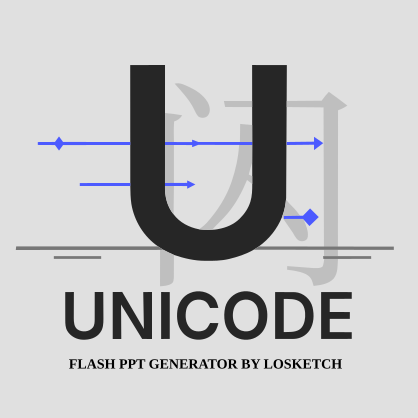

<div align="center">
  
# Unicode-Flash-Mob（Unicode快闪视频生成器）
[](https://www.bilibili.com/video/BV1o94y177BM)
[](https://github.com/Losketch/Unicode-Flash-Mob/releases/latest)
[](https://github.com/Losketch/Unicode-Flash-Mob/releases/latest)
[](https://github.com/Losketch/Unicode-Flash-Mob)
[](https://github.com/Losketch/Unicode-Flash-Mob/blob/main/LICENSE)



</div>

## 简介

Unicode-Flash-Mob 是一款将字体中的 Unicode 字符自动排布并渲染成 PNG、再合成为快闪视频的工具。支持自定义背景、布局。

## 快速上手

### 1. 下载预编译版本

1. 前往 Releases 页面直接下载 Windows 可执行文件：  
👉 https://github.com/Losketch/Unicode-Flash-Mob/releases/latest

2. 鼠标右键资源管理器中存放脚本的目录的空白处，点击 `在此次打开 PowerShell 窗口(S)`，输入 `./run.ps1` 并回车运行。

或 鼠标右键 `run.ps1` 文件，点击右键菜单的 `使用 PowerShell 运行`。

### 2. 源码运行或二次开发

克隆仓库并安装依赖：

```bash
git clone https://github.com/Losketch/Unicode-Flash-Mob.git
cd Unicode-Flash-Mob
cargo build --releases
pip install -r requirements.txt
```

---

## 在 Windows 上使用「内存文件系统」加速

如果你担心大量小文件写入对硬盘造成 IO 压力或减少 SSD 寿命，推荐在 Windows 上挂载一个 RAM 磁盘：

1. 安装 ImDisk Toolkit（免费开源）  
   下载地址：https://sourceforge.net/projects/imdisk-toolkit/

2. 以管理员身份运行 CMD，创建 1 GB RAM 磁盘并挂载到 `R:`：

   ```bat
   imdisk -a -t vm -s 1G -m R: -p "/fs:ntfs /q /y"
   ```

3. 将脚本都放置在磁盘 `R:`中。

4. 脚本执行完毕后，手动卸载并释放内存：

   ```bat
   imdisk -D -m R:
   ```

> **注意**：RAM 磁盘的数据完全驻留内存，关机或重启后所有文件都会丢失，请务必在卸载前将最终结果备份到物理盘。

---

## 常见问题

### raster overflow

此错误多因单张图过大或字符量过多导致内存占用过高。可尝试：

1. 缩小输出分辨率（如由 1920×1080 调至 1280×720）
2. 调整字体大小 `middle_font_size`
3. 分批处理 Unicode.txt（拆分成小文件）
4. 如果实在无法避免，升级至更大内存的机器

---

## 彩色字体支持

本项目支持渲染彩色字体（Color Fonts），包括以下格式：

### 支持的彩色字体格式

| 格式 | 说明 |
|------|------|
| **COLR** | Microsoft COLR/CPAL 表格，使用 Skia 后端渲染 |
| **SBIX** | Apple sbix 表格（位图彩色字体） |
| **CBDT/CBLC** | Microsoft CBDT/CBLC 表格（位图彩色字体） |
| **SVG** | OpenType SVG 表格，使用 skia-python 直接渲染 SVG |

### 技术实现

- **COLR 渲染**：使用 `blackrenderer` 库的 Skia 后端，通过 `SkiaPixelSurface` 渲染矢量彩色字形
- **SVG 渲染**：使用 `skia-python` 的 `SVGDOM` 直接解析和渲染 SVG 文档
- **位图渲染**：直接提取嵌入式位图数据并转换为 PNG

### 依赖要求

> **注意**：确保使用 `blackrenderer[skia]` 而非 `blackrenderer[cairo]`。

## 授权许可

本项目基于 Apache License 2.0 发布，详见 [LICENSE](LICENSE)。  
您可自由使用、修改、分发（包括商用），但须保留原始版权声明和许可文本，并在修改后文件中注明“由此文件衍生”。
